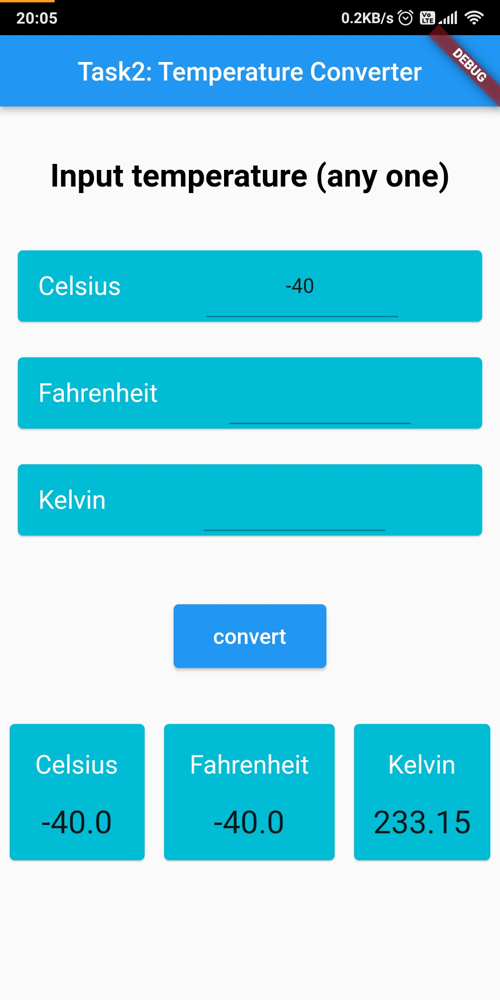
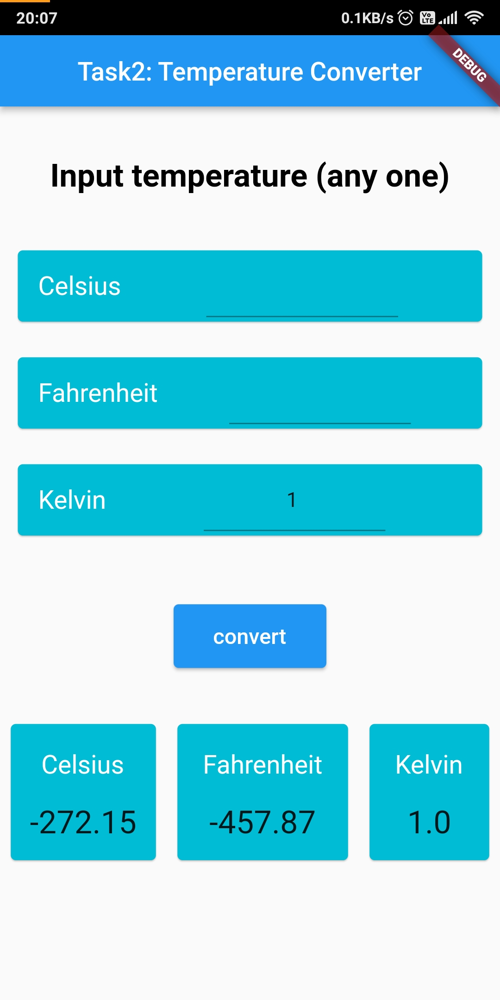
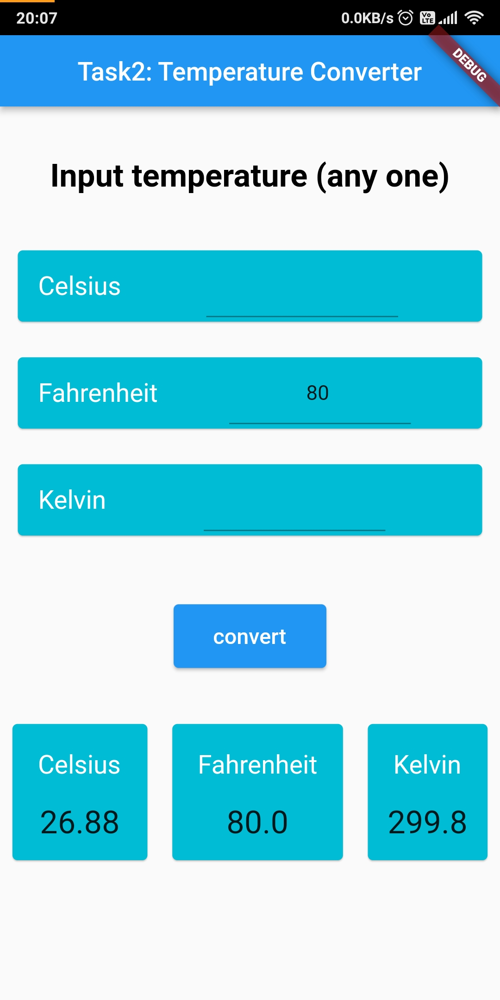
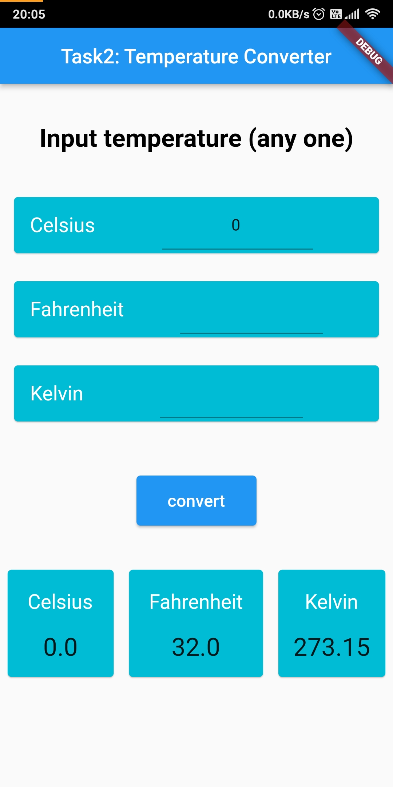
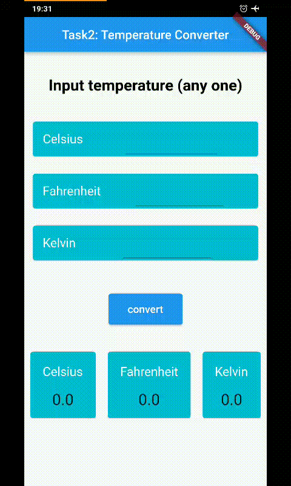

# Taapmaan

- A new Flutter project for Temperature Converter

- You can convert from Celsius/Fahrenheit/Kelvin to Fahrenheit/Celsius/Kelvin

## Screenshots

|  |   |   |   |
| -------------------------- | -------------------------- | -------------------------- | -------------------------- |

## The app looks like this ⬇

